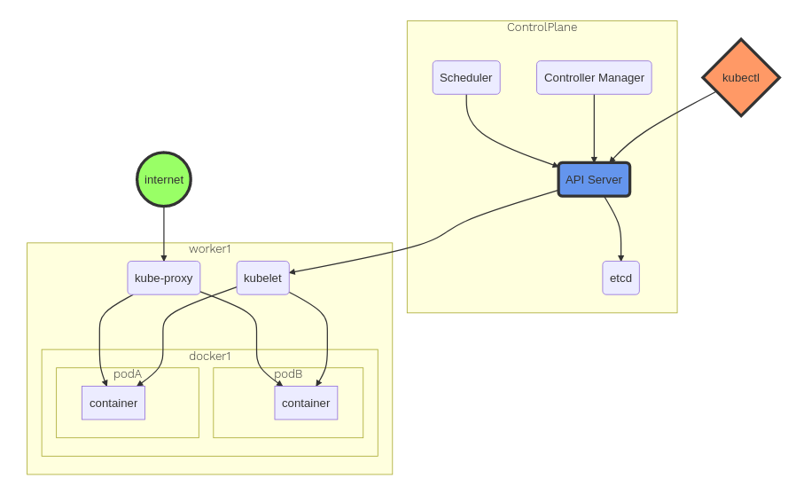
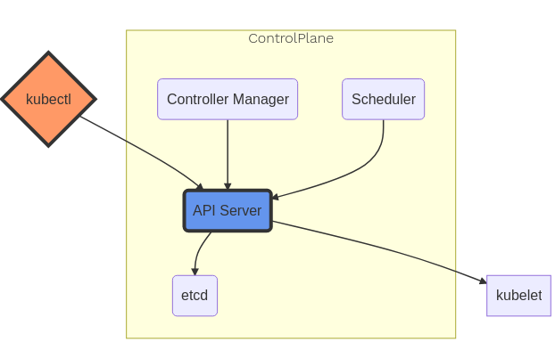
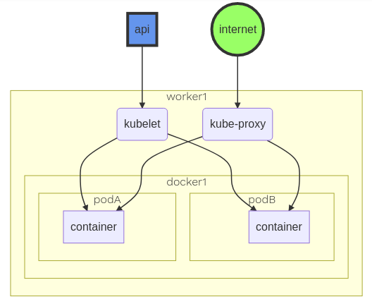
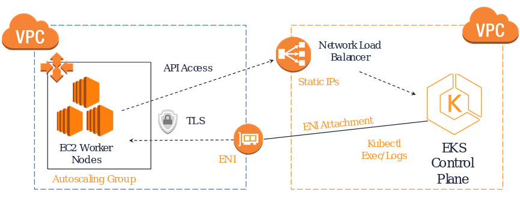

# eksworkshop

## notas

* There are two types of nodes:
  * A Control-plane-node type, which makes up the Control Plane, acts as the “brains” of the cluster.
  * A Worker-node type, which makes up the Data Plane, runs the actual container images (via pods).

* Create cluster with terraform in version kubernetes 1.18
  * 4 min duration
  * Upgrade to 1.19 active in console with 24 min.

### Architectural Overview

### Control Plane

### Data Plane

### EKS Architecture for Control plane and Worker node communication

## References

* [eksworkshop](https://www.eksworkshop.com)